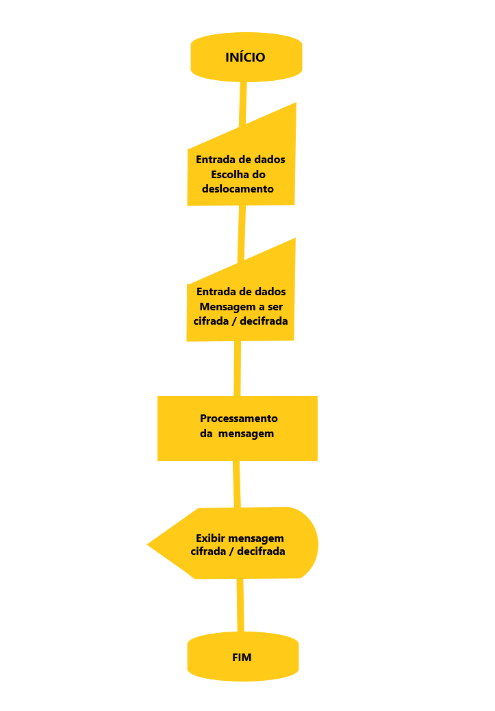

# Introdução #
A cifra de César, também chamada de Cifra de troca, é uma das mais simples técnicas de criptografia, onde cada letra de sua mensagem desejada é substituída por outra, de acordo com o número de deslocamento escolhido também pelo dono da mensagem. Essa técnica foi nomeada em homenagem a Júlio César, que a utilizava para trocar segredos militares, mas atualmente todos podemos utilizá-la para trocar mensagens secretas entre amigos, guardar senhas importantes, guardar anotações pessoais ou o que mais for interessante para o usuário.

# Mensagem Cifrada #
Este projeto consiste em um website desenvolvido para permitir que o usuário tenha a experiência de cifrar uma palavra de sua escolha, podendo escolher o tamanho de deslocamento da cifra, bem como decifrar uma mensagem que tenha recebido cifrada, desde que utilize o mesmo tamanho de deslocamento utilizado no momento da cifragem recebida. Deslocamentos negativos também podem ser utilizados, invertendo a direção para onde o deslocamento normalmente aconteceria. Já caracteres especiais, como por exemplo @, #, ? e *, incluindo espaços entre as palavras, permanecem intactos na mensagem. 

Os usuários foram definidos através de percepção pessoal da sociedade, onde observo que o público de jovens adultos seria atraído pela proposta de poder "esconder" pequenas mensagens e repassá-las aos colegas de trabalho, faculdade ou guardá-las para si como um segredo, seja por serem de cunho pessoal ou até mesmo senhas de banco ou e-mail. O site seria visto como algo divertido além de útil e poderia se popularizar através do boca a boca, não só pelo interesse inicial do usuário que fosse cifrar sua mensagem, como também pela necessidade da pessoa que porventura recebesse a mesma de entrar no site para decifrá-la.

A decisão de aproximar a linguagem utilizada no site para algo mais próximo de uma conversa entre amigos se deve a inteção de que o público alvo o receba como um site mais popular e menos formal, se sentindo a vontade com ele e que pudesse enxergá-lo também como um lazer.

# Modo de utilização #
Para utilizar a cifra de César do nosso site, o usuário deve inicialmente escolher o número de deslocamento desejado e depois digitar a frase que deseja cifrar dentro do campo indicado logo ao lado e clicar em "criptografe". A mensagem cifrada resultante será exibida abaixo do campo digitado e o usuário poderá copiar e colar esta mensagem em um bloco de notas ou anotação de sua preferência.

Para descriptografar, deve utilizar o campo a sua direita, escolhendo o deslocamento igual ao que foi escolhido no momento da criptografia e em seguida, deve digitar ou colar a frase criptografada no campo indicado e clicar em "Descriptografe", tendo a mensagem decifrada resultante exibida abaixo do campo digitado.

# Pré requisitos #
Para a utilização deste website o usuário necessita de um computador, laptop, tablet ou celular com acesso a internet e um navegador com JavaScript habilitado. Não é necessária nenhuma instalação adicional. 

# Desenho do projeto com Diagrama de fluxo #

